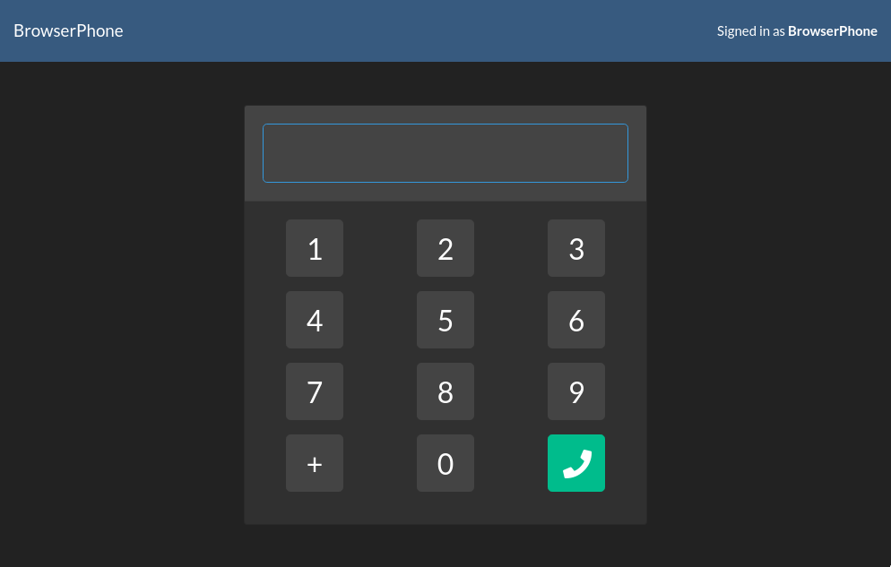

# Luzifer / browserphone

Implementation of Twilio browser phone based on the [TwilioDevEd/client-quickstart-js](https://github.com/twiliodeved/client-quickstart-js).



## Setup

Follow the [instructions in the README](https://github.com/TwilioDevEd/client-quickstart-js/blob/master/README.md) of the client-quickstart-js project and remember the `capability-token` URL:

```console
# docker run --rm -ti -p 3000:3000 -e CAP_TOKEN_URL=https://<YOUR URL>.twil.io/capability-token luzifer/browserphone
```
